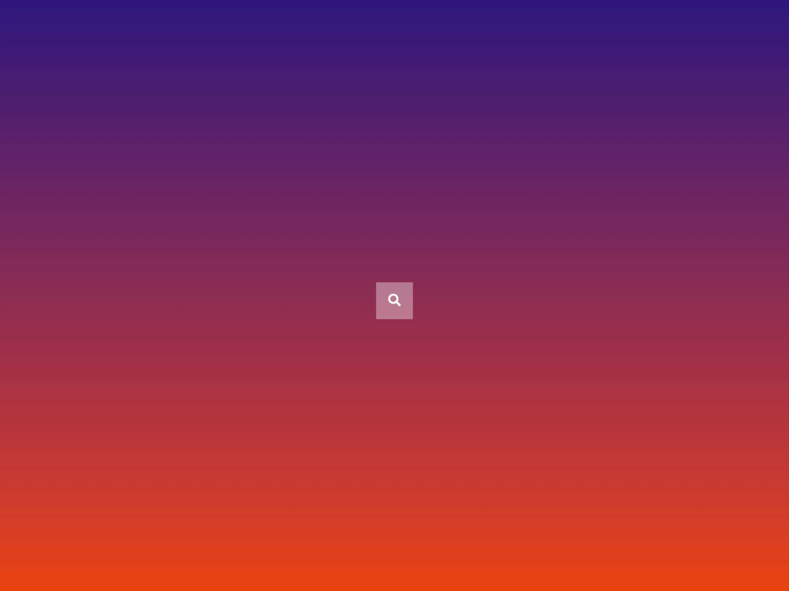

<p id="header"><p>

<table><tr>
<td> <a href="https://github.com/emjose/progress-bar/#header"></a> </td>
<td> <a href="https://github.com/emjose/one-hundred/#header"></a> </td>
<td> <a href="https://github.com/emjose/expand-search-two/#header"></a> </td>
</tr></table>

<br>

<p id="project-title"><p>

<a href=#table-of-contents></a>

<br>

<a href="https://emjose.github.io/expand-search-one"></a> 

#

<p id="table-of-contents"><p>

<a href=#table-of-contents></a>  

- [100 Days of Code](#100days)
- [Installation](#installation) 
- [Live Site](#live-site)
- [Resources](#resources)
- [Let's Connect!](#lets-connect) 

#

<p id="100days"><p>

<a href=#100days></a>  

### Day 4: February 6, 2021
- For Day 4, I completed tutorials for expanding/hidden search bars.

- See <a href="https://github.com/emjose/expand-search-two/#header">second search bar</a>.

#

<p id="installation"><p>

<a href=#installation></a>

#### Git clone and cd into the repo folder:
``` 
git clone git@github.com:emjose/expand-search-one.git && cd expand-search-one
```
#### Run the command:
```
open index.html
```

#

<p id="live-site"><p>

<a href="https://emjose.github.io/expand-search-one"></a>  

<a href="https://emjose.github.io/expand-search-one"></a>

#

<p id="resources"><p>

<a href=#resources></a>  

- #### [Font Awesome Icons and Logos](https://fontawesome.com/)

- #### [50 Projects in 50 Days Udemy Course](https://www.udemy.com/course/50-projects-50-days/)

- #### [Hidden Search Bar Tutorial 1](https://youtu.be/pReHDgS3unQ) by [Web Design University](https://www.youtube.com/channel/UCdBMlU4fsTv7owBqJ5NntrQ)

- #### [Hidden Search Bar Tutorial 2](https://youtu.be/uQaVyb9s_qg) by [CodingNepal](https://www.youtube.com/channel/UCk7xIEmd3MeyhIu2StLX5yA)

- #### [My blog on how I created my Github READMEs](https://emmanueljose.medium.com/readme-a-makeover-story-b9c7be37a6de?sk=7ae6623d365409d875753e4604e42ffd) 

#

<p id="lets-connect"><p>

<a href=#lets-connect></a>

<p><a href="https://twitter.com/Emmanuel_Labor"> <a href="https://www.linkedin.com/in/emmanuelpjose/"> <a href="https://emmanueljose.medium.com/"> <a href="https://www.instagram.com/emmanuel_jose/"> <a href="mailto:emjose@gmail.com"> <a href="https://www.youtube.com/channel/UCQdqFg-_J83jn9xJRd1W3tQ/videos"> <a href="https://github.com/emjose"></p>

#

<a href=#header></a>